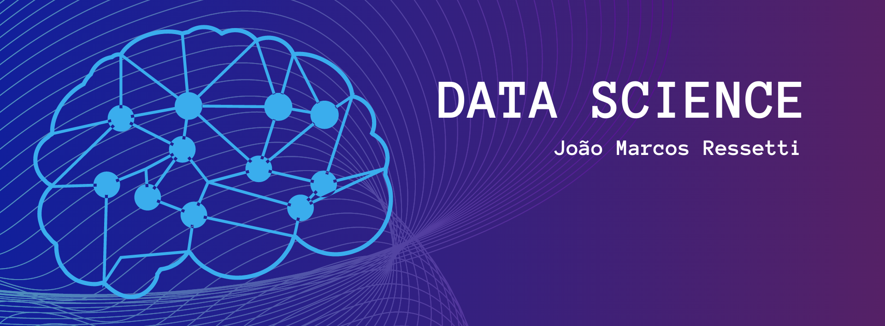

 

  

# Portfólio de Data Science

Este é meu portfólio pessoal de data science onde eu coloco todos os meus projetos de data science.

**Links:**
* [LinkedIn](https://www.linkedin.com/in/jo%C3%A3o-marcos-ressetti/)

## Projetos:

---

